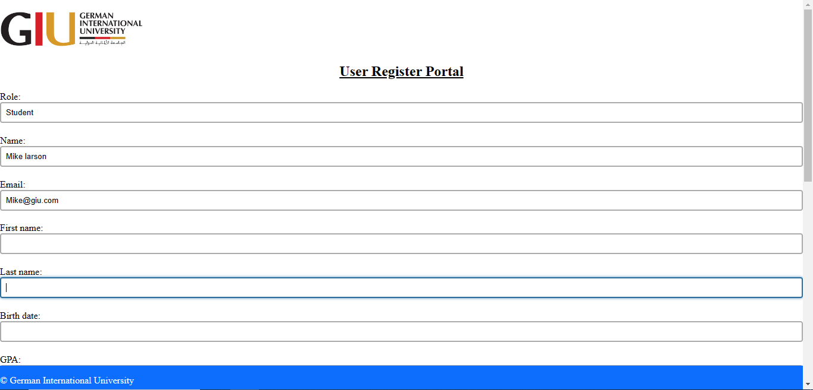
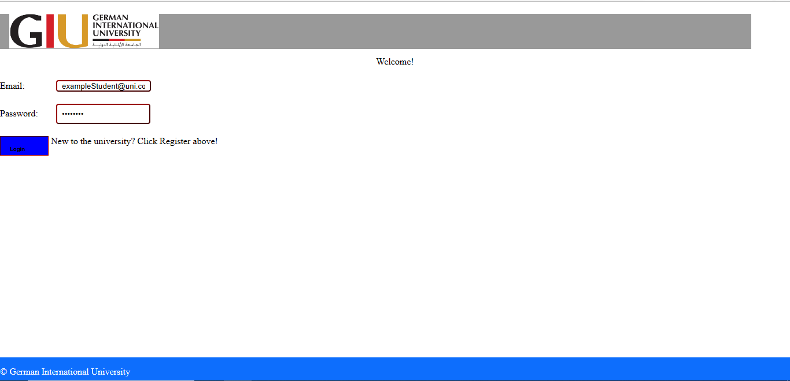
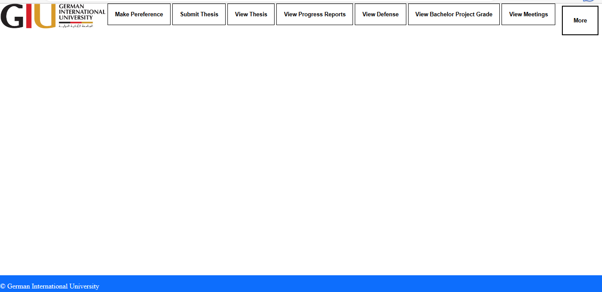
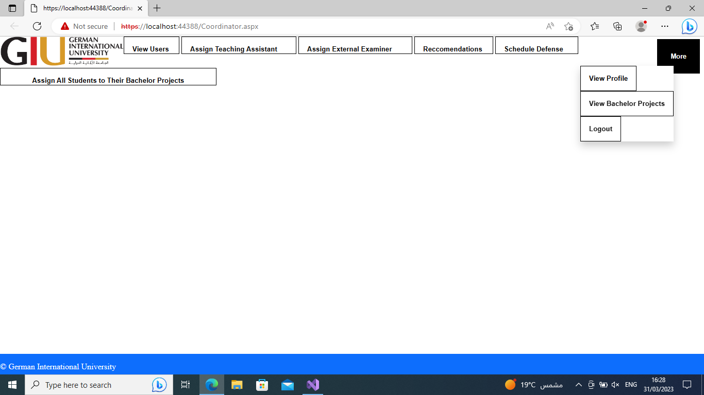

<html>
<h1>Bachelor Project Portal</h1>
   
    <h2>
    Table of contents
    </h2>
    <h3> 
        <ul>
            <li>Project Title</li>
            <li>Table of contents</li>
            <li>Description</li>
            <li>Usage</li>
            <li>Preview</li>
        </ul>
    </h3>
     
    <h2>Description</h2>
    <h3>This project has been developed with sql for the database , C# , ASP.net and a bit of javascript.
    The project is about creating a web portal for bachelor students , the website have many different roles for example:
    Students, Lecturers, External Examiners, Coordinators, admins and many more (Around 15 user options).The goal is to 
    ease the process of getting the students bachelor starting from choosing their bachelor topic,grading defense,creating meetings
    with the instructors ,managing companies and their employess for external industial project , allowing examiners to create 
    different types of projects for students  etc...
     
    This project is created for my university The German International Univeristy (GIU)
     
    Note :This Project was mainly a database project (1.5k+ lines of sql),thus the frontend is not at a professional level.</h3>
     
    <h2>Usage</h2>
    <h3><ol>
            <li>Run the sql files (Tables and Procedures)</li>
            <li>Navigate to web.config file in the frontend directory</li>
            <li>change the connection string to the location of your database</li>
            <li>Run the Register.aspx file</li>
            <li>then login and use whatever options available for your specified role</li>
        </ol></h3>
     
    <h2>Preview</h2>
     
    <h3>Register Page</h3>
     
    
     
    <h3>Login Page</h3>
     
    
     
    <h3>Student HomePage</h3>
     
    
     
    <h3>Lecturer HomePage</h3>
     
    
</html>
